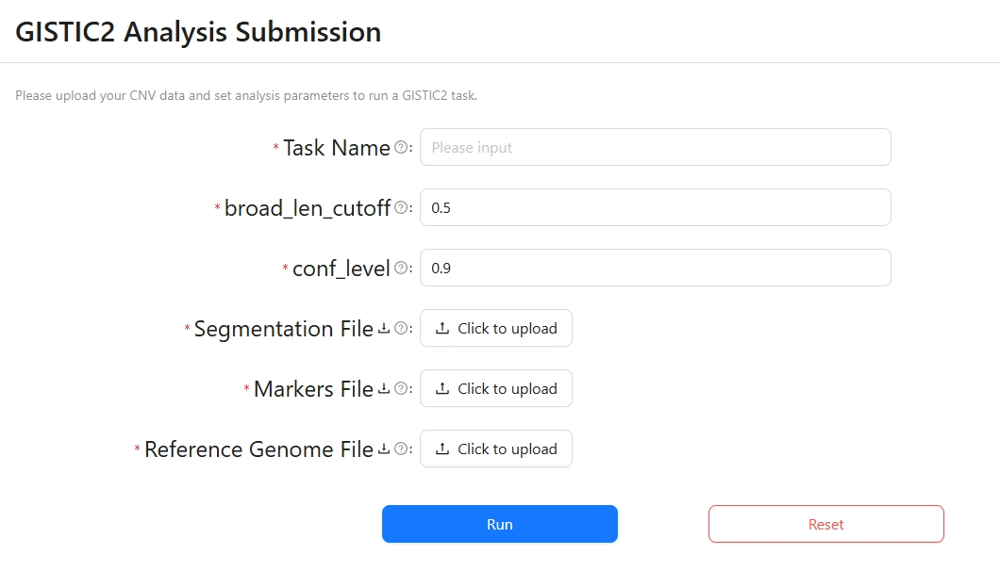
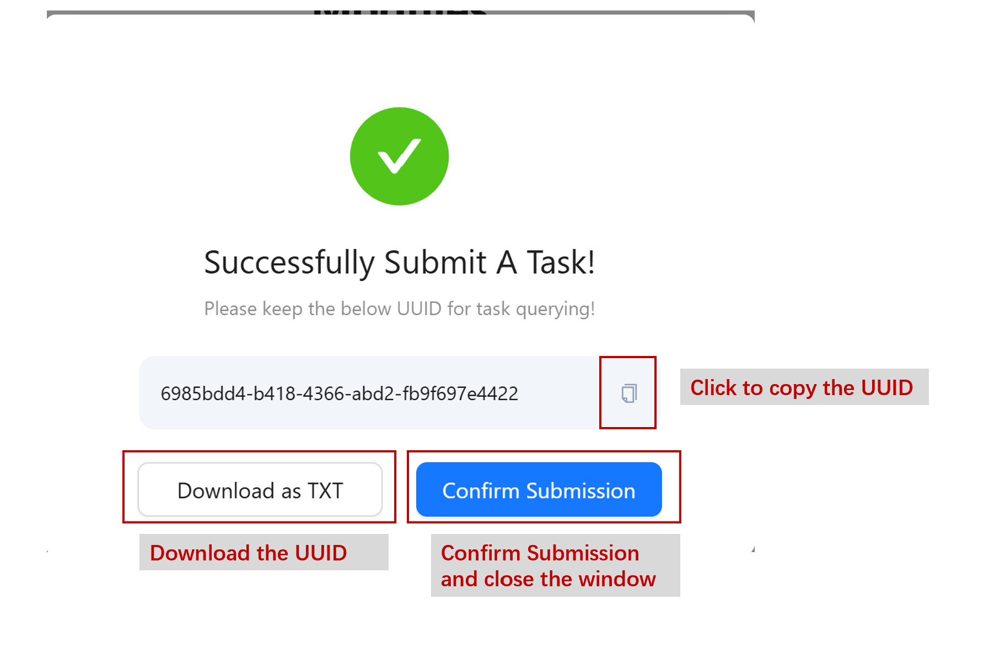
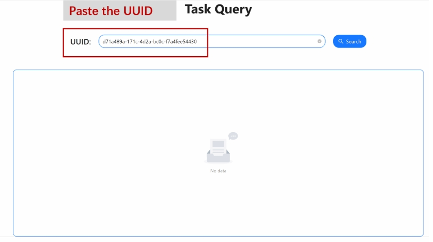
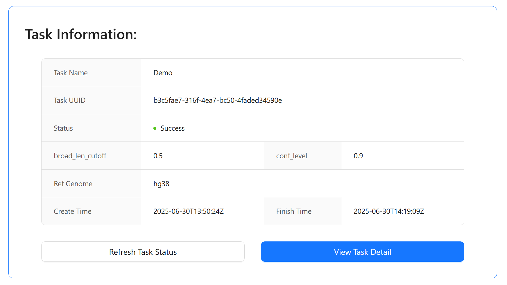

# CNVScope Analysis

CNVScope provides a `Recurrent CNV Analysis` interface, designed to help users easily configure and launch a GISTIC2 task for recurrent CNV analysis.

## Submission settings

As illustrated, the user is required to specify a `unique name` for the analysis task, and several analysis parameters:
+   `broad_len_cutoff`: A threshold value (default 0.5) for distinguishing broad from focal events.
+   `conf_level`: The confidence level (default 0.9) used for identifying significant CNV peaks.

Moreover, ssers must upload three required files for the analysis:

+   `Segmentation File`: Contains segmented CNV data.
+   `Markers File`: Contains marker information for mapping CNV segments.
+   `Reference Genome File`: Specifies the reference genome used in the analysis.

## Submit the task

Next, users can click `Run` button to start the GISTIC2 analysis with the provided parameters and files. If Users want to restart the submission process, they can click `Reset` button to clear all input fields and uploaded files.

After submission, you will get a notice of successful submission.

## Submission query

Users can go to `WORKSPACE` interface to query the status and results of submitted tasks.

If the status is Failed, please check if the uploaded files meet the requirement. If you confirm that there is no problem with the uploaded file, please contact us.