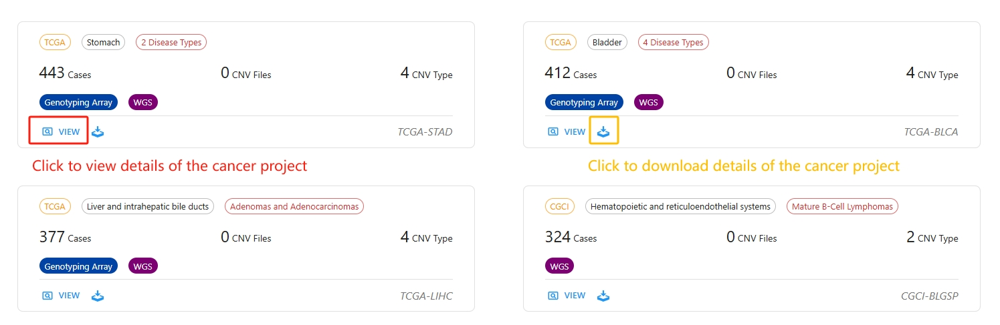

# Welcome to CNVScope

CNVScope a comprehensive resource that integrates copy number variations (CNVs) from pan-cancer data protal (e.g. TCGA, TARGET, etc.), involing **47** cancer type projects, **19,905** cancer cases, **467,206** biospecimens, **112,297** CNV profiles, and **239,645** associated clinical records.

In this tutorial, we will walk you through the different interfaces available on CNVScope database. 

## HOME
The ``HOME`` interface offers a concise introduction to the CNVScope database, presenting key statistics on CNV projects, cases, biospecimens, profiles and clinical records. 

## DATASET

The ``DATASET`` interface first displays the main dataset filtering panel of the CNVScope database. The interface allows users to efficiently browse and select datasets based on multiple criteria relevant to cancer genomics research. The filtering options are grouped into four main categories:

- `PROGRAM`: Lists the major research programs contributing datasets, such as TCGA, CGCI, and TARGET. The number in parentheses indicates the number of datasets available from each program.

- `DISEASE TYPE`: Allows users to filter datasets by specific disease or tumor types, such as Adenomas and Adenocarcinomas, Squamous Cell Neoplasms, and Gliomas. The numbers indicate dataset counts per disease type.

- `PRIMARY SITE`: Enables selection of datasets according to the anatomical origin of the samples, such as Bronchus and lung, Kidney, Brain, and Colon.

- `EXPERIMENTAL STRATEGY`: Users can filter datasets based on the experimental platforms used, like Whole Genome Sequencing (WGS) or Genotyping Array.

A search bar ("Fuzz Search by Keywords...") is provided at the top to enable keyword-based searches. Users can also sort datasets using the `"Sort by Cases/Project ID/CNV Files/CNV Records/Primiary Sites Number/Disease Types Number/Experimental Strategies Number"` feature. Additional filters and the option to clear all selected filters are available at the bottom for more refined dataset exploration.

This figure shows the filtered results panel in the CNVScope database after applying specific filters. Each card represents a single project and provides a concise summary of its key attributes:

- `Project Information`: The colored tags at the top indicate the project source (e.g., HCMI, TCGA), the number of primary sites, and the number of disease types included in the dataset. If a specific disease type is included, it is highlighted in red.

- `Summary Statistics`: 
    +   `Cases`: Total number of cases or samples available in the project.
    +   `CNV Files`: Number of copy number variation (CNV) files available for download.
    +   `CNV Type`: Number of CNV event types cataloged in the dataset.
    +   `Experimental Strategy`: Below the summary statistics, colored badges indicate which experimental strategies were used (e.g., Whole Genome Sequencing (WGS), Genotyping Array).

At the bottom of each project card, users can click to `view` detailed information about the project, and `download` available files for the project.