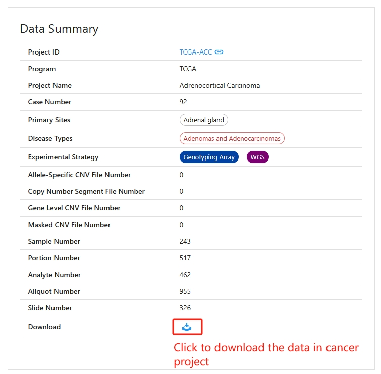
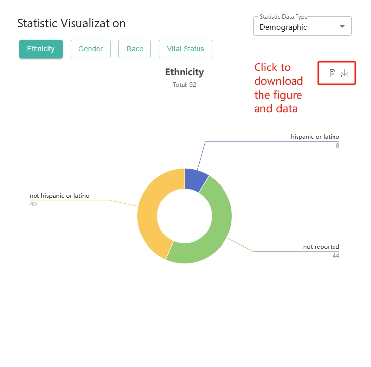
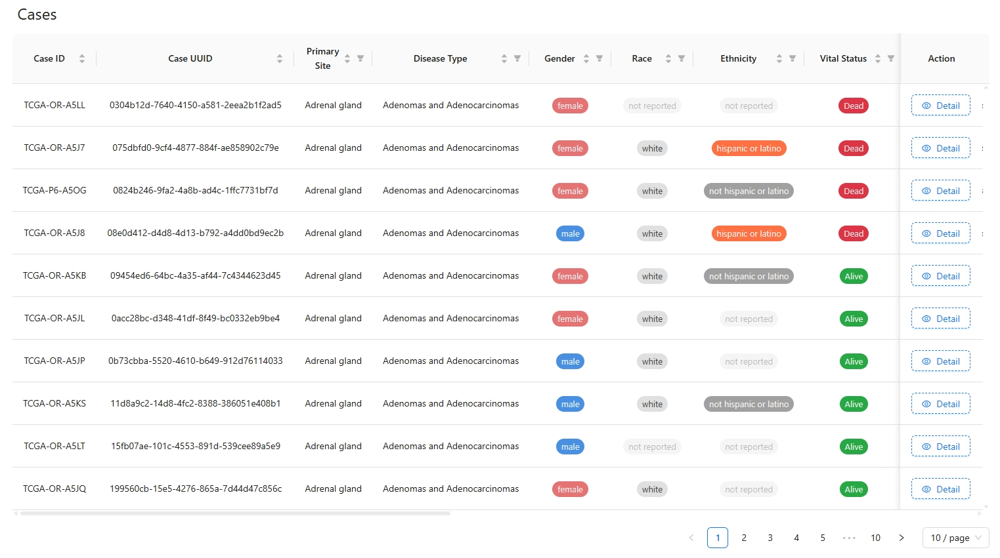
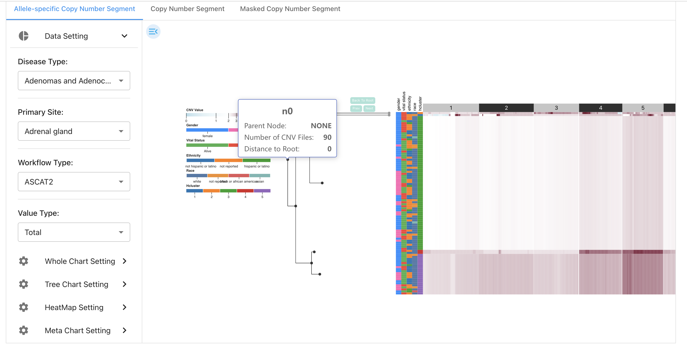
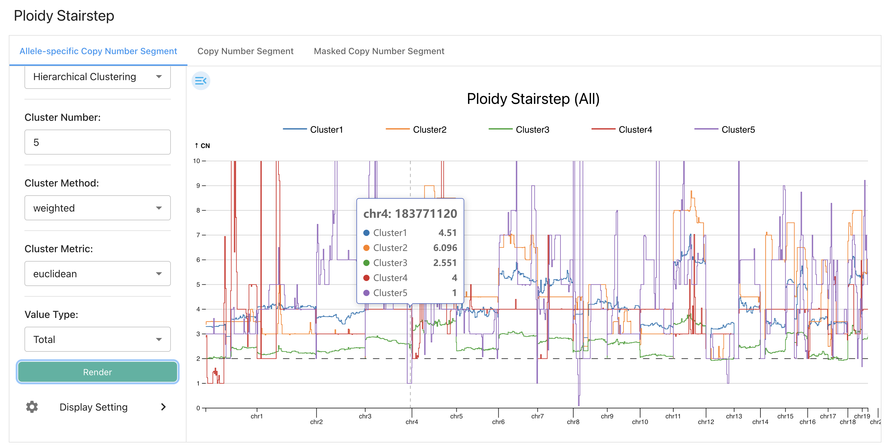
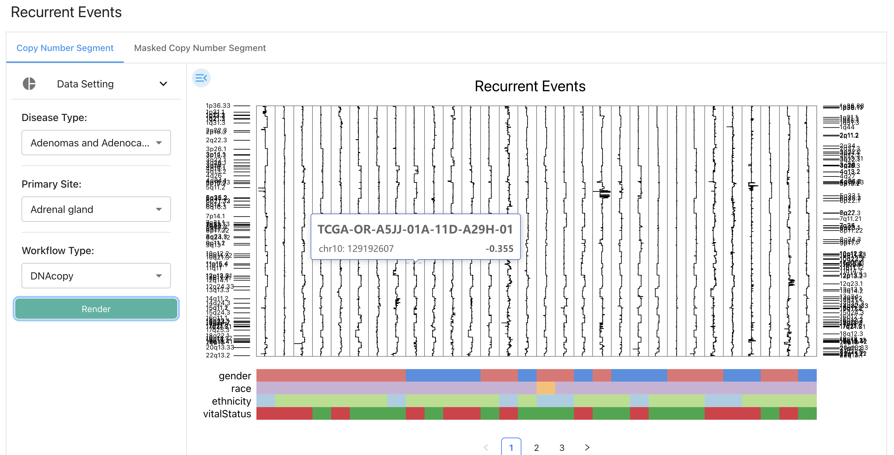
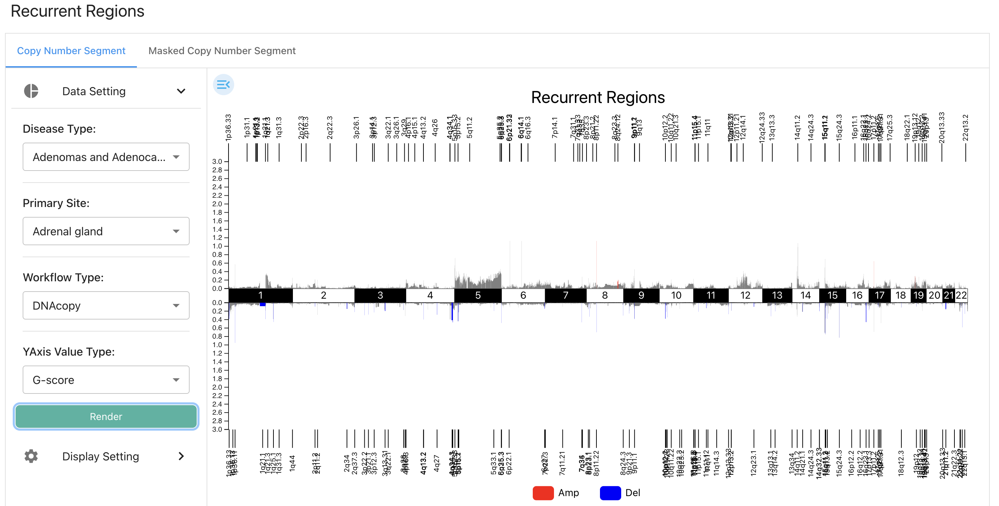

# CNVScope Visualization

CNVScope provides comprehensive visualization interfaces for users to explore and investigate the CNV profiles for each cancer project.

## Project Data Summary Panel

Project Data Summary panel for a cancer project provides a comprehensive overview of essential metadata and dataset statistics, enabling users to quickly understand the scope and contents of the project. The key components include:

-   `Project ID`: A unique identifier for the project, here linked as TCGA-ACC, allowing users to navigate to additional project details or external resources.

-   `Program`: Indicates the source program of the dataset (e.g., TCGA).

-   `Project Name`: The descriptive name of the study or cancer type (e.g., Adrenocortical Carcinoma).

-   `Case Number`: The total number of cases or patients included in the dataset.

-   `Primary Sites`: The anatomical site(s) of origin for the samples (e.g., Adrenal gland).

-   `Disease Types`: The specific disease or cancer classification (e.g., Adenomas and Adenocarcinomas).

-   `Experimental Strategy`: Labels for the types of experimental platforms used, such as Genotyping Array and Whole Genome Sequencing (WGS).

-   `File Statistics`: Lists the count of various file types available for this project, including: `Allele-Specific CNV Files`, `Copy Number Segment Files`, `Gene Level CNV Files`, `Masked CNV Files`.

-   `Sample & Material Counts`: Provides the number of: `Samples`, `Portions`, `Analytes`, `Aliquots`, `Slides`.

A download icon is provided at the bottom, allowing users to quickly download available files for the project.

## Statistic Visualization Panel

Statistic Visualization Panel is designed to provide users with interactive and visual summaries of key sample attributes, including:

-   `Statistic Data Type Selector`: At the top right, users can choose the category of statistics to display, such as "Demographic".

-   `Attribute Tabs`: Users can quickly switch between different demographic and clinical attributes, including Ethnicity, Gender, Race, and Vital Status, using the buttons at the top left.

-   `Visualization Display`: The main area shows a donut chart summarizing the distribution of the selected attribute. 

Users can click the button to download the chart data or export the visualization for reporting purposes.

## Cases Table Panel

Cases Table Panel provides a detailed, sample-level overview of all cases in a selected project dataset. 

Here, each row corresponds to a unique case, displaying critical attributes such as: `Case ID` and `Case UUID` for unique identification. `Primary Site` and `Disease Type` specifying the anatomical origin and diagnosis. `Gender`, `Race`, `Ethnicity`, and `Vital Status` for demographic and clinical context.

Categories such as `gender` (e.g., female, male), `race`, `ethnicity`, and `vital status` (e.g., alive, dead) are visually highlighted using colored tags, allowing for quick identification and comparison.

CNVScope provides sortable and filterable columns. Specifically, columns feature sorting and filtering icons, enabling users to organize or filter the data for more focused analysis.

The table supports pagination controls at the bottom, allowing users to navigate through large datasets efficiently and adjust the number of cases displayed per page.

Finally, each row includes a `Detail` button, which users can click to view more comprehensive information about an individual case.

## Chromosome Level & Gene Level CNV HeatMap Panel

`A CNV heatmap with cases as rows and chromosome-level genomic regions as columns, equied with zoomable cut-dendrogram and case meta annotation`

Over the past two decades, CNV heatmap has often been adopted to visualize the CNV profiles of a batch of samples in various sequencing protocols. e.g. bulk SNP array, whole genome/exon sequencing. CNV heatmap aids the landscape view of single case copy number in several pieces of literature. It is essential to reduce the size of heatmap while retaining the heterogeneity among cases. Cluster zoom-in operation is achieved by clicking the node in the dendrogram.  

Here, we build viz interface ''CNV Heatmap''  for interactive and real-time visualization of CNV landscape of a cancer project with zoomable dendrogram. With cases as rows and chromosome-level genomic regions as columns, the CNV heatmap exhibits the copy number of a specific case across the entire genome. The clinical meta heatmap is displayed on the left. A zoomable cut dendrogram is displayed on the left. If the mouse hovers over case CNV/meta heatmap, cutted dendrogram, and stairstep, an interactive tooltip carried its vital information will appear. 

### Interactions

  + Download  
    An png file will be generated when you click the "Download'' button. 
  + Tooltips and Highlights  
    When your cursor hovers over a component on the visualization panel, essential information about the component will show up in the tooltip, and related components will be highlighted. There are several major types of component in the "CNV Heatmap'' application and their tooltipping and highlighting interactions are as follows:
    - Unit Component on the Cell CNV Heatmap  
      The tooltip will display the genome position and copy number of a unit. The name of the corresponding leaf node in the cutted dendrogram will also be shown. Further, the genome position, the leaf node, and the range of the leaf node will be highlighted.
    - Unit Component on the Cell Meta Heatmap  
      The tooltip will display the case ID and meta label of a unit.
    - Cutted Dendrogram Node  
      The tooltip will display the name of the current node, the number of cases in it, the parent node of it, and the distance between it and the root node. Further, the subtree and the covered case range of the current node will be highlighted.
    - Cutted Dendrogram Branch  
      The tooltip will display the names of the associated parent and child nodes and their branch distance. The branch, the parent node, and the child node ill be highlighted.
    - Unit Component on the Aggregate Subgroup CNV Heatmap  
      The tooltip will display the genome position, the copy number, and the subgroup name.
    - Component on the Aggregate Subgroup CNV Stairstep  
      The tooltip will display the genome position and the average copy number of cases for all subgroups.
  + Dendrogram Zooming  
    When users click a node in the cutted dendrogram, the selected node will be regarded as the temporary tree root, and a new sub-cutted dendrogram will be rendered. The case CNV heatmap and meta panel will also be updated to fit the current case range. When you click the "Back to Root'' button, the whole CNV view will return to its initial status. You may also utilize the "left arrow'' and "right arrow'' buttons to un-do and re-do zooming operations.

### Editor Functionality

The editor offers various options to fine-tune the visualization. Users can adjust the editor width and font size in "Editor Settings''.

  + General Settings 

    - Auto load heatmap  
      Checkbox for user to decide whether the case CNV heatmap will automatically be loaded. 
    - NA cases (separated by comma ,)  
      User can define the NA cases in CNV csv file, the default `N/A,NA` means empty space `""`, string `N/A`, and string `NA` will be considered NA cases by file parser.
    - Reorder cases by  
      Users can reorder cases in case CNV/meta heatmap by meta labels in ascending or descending order. The default order is the case ordered in uploaded CNV csv file. Please note this functionality is effective only when on cutted dendrogram JSON file supplied.
    - Aggregate subgroup  
      Users can select categorical meta label to display in aggregate subgroup CNV heatmap and stairstep. The average copy number value in subgroup will be displayed.

  + Select categorical meta label  
    Users can choose which categorical meta label to show in the heatmap. Please note this functionality is effective only when on cutted dendrogram JSON file supplied.

  + Layout Settings 

    - Basic 

      + Figure margin - left  
        User can adjust the left margin of the figure.
      - Figure margin - top  
        User can adjust the top margin of the figure.
      - Genome zoom slider - height  
        User can adjust the height of genome zoom slider.
      - Margin between CNV heatmap and genome zoom slider  
        User can adjust the margin between CNV heatmap and genome zoom slider.
      - Margin betwenn cutted dendrogram and meta heatmap  
        User can adjust the margin between cutted dendrogram and meta heatmap.

    - CNV Heatmap

      - Unit height of CNV heatmap, unit width of CNV heatmap (integer recommended)  
        User can adjust the unit height and unit width of CNV heatmap. Unit refers to the smallest rendered png object in heatmap. Please note that the heatmap unit height and unit width are recommend to set as integer, floating point will make heatmap transparent owing to subpixel rendering.
      - Chromosomes - height  
        Users can adjust the height of chromosomes.
      - Show vertical line between chromosomes  
        User can decide whether to show vertical line between chromosomes.
      - Desired width of CNV heatmap  
        Users can adjust the width of CNV heatmap, default is 1000.
      - Left highlight - width  
        User can adjust the width of left highlight.
      - Top highlight - height  
        User can adjust the height of right highlight.

    - Meta Heatmap

      - Unit width of meta heatmap  
        User can adjust the unit width of meta heatmap. 
      - Meta heatmap legend - width  
        User can adjust the width of meta heatmap legend.
      - Margin between different meta heatmap legends  
        User can adjust the margin between different meta heatmap legends.

    - Cutted Dendrogram

      - Dendrogram - width  
        User can adjust the width of cutted dendrogram.

  + Color palettes  
    Users can customize color palettes for available categorical meta labels and continuous meta labels.

## Ploidy Stairstep Panel

`Subclone/case CNV ploidy line plot across the genome.`

The CNV ploidy distribution can intuitively show tumor heterogeneity. The ploidy line plot along the chromosomes can also visually show the heterogeneity between tumor sample groups by combining genomic coordinates. By collapsing the  cases in the same tumor sample groups into one observation, we can infer the pseudo-bulk ploidy of each sample group. Since cancer CNV ploidy line alters along chromosomes, we call it the "stairstep plot''.

In Ploidy Stairstep Panel, the columns will list all categorical meta labels available the database. The first row displays the ploidy stairstep of bulk profiles. The second line exhibits the ploidy stairstep of all subgroups for specific categorical meta labels in an aggregate form. Then, the following rows will list the ploidy stairstep of all available subsets individually.
Users can decide to display or hide these meta labels and subsets in "Editor-Select categorical meta label''. 
If the mouse hovers over the stairstep plot, an interactive tooltip carried its vital information will appear. 

### Interactions

  + Download  
     An png file will be generated when you click the "Download'' button. 
  + Tooltips and Highlights  
    When your cursor hovers over a component on the visualization panel, essential information about the component will show up in the tooltip, and related components will be highlighted. There are two major types of component in the "Ploidy Stairstep'' application and their tooltipping and highlighting interactions are as follows:
    + Stairstep plot  
      The tooltip will display the genome position and the average copy number.
    + Aggregate subgroup distribution plot  
      The tooltip will display the genome position and the average copy number for each subgroup respectively.

### Editor Functionalities

The editor offers various options to fine-tune the visualization. Users can adjust the editor width and font size in "Editor Settings''.

  + Demo File Sets, Files  
     Demo file sets and files Functionalities are the same with "CNV View'' visualization.
  + General Settings 
    + Maximum CN value  
       Users can adjust the maximum CN value of y-axis.
    + Stairstep plot height  
       Users can adjust the height of each stairstep plot.
    + Stairstep plot width  
       Users can adjust the width of each stairstep plot.
    + Stairstep plot line width  
       Users can adjust the line width of each stairstep plot.
  + Select categorical meta label  
    Users can choose which categorical meta labels to display.
  + Color Palettes  
    Users can customize color palettes for available categorical labels.
           

## Recurrent Events & Regions Panel

`A visualization of focal CNV gain and loss across cohorts between multiple samples.`

In CNVScope, we also develop readily available viz interface "Recurrent Event/Region''  for interactive and real-time visualization of CNV profiles across multiple samples.

"Recurrent Event" displays the CNV stairsteps of all samples. The gene box shows the recurrent genes.  If the mouse hovers over the sample group in stairstep and gene box, an interactive tooltip carried its vital information will appear. 

### Interactions

  + Download  
    An png file will be generated when you click the "Download'' button. 
  + Tooltips and Highlights  
    When your cursor hovers over a component on the visualization panel, essential information about the component will show up in the tooltip, and related components will be highlighted. There are several major types of component in the "Recurrent Event'' application and their tooltipping and highlighting interactions are as follows:
    + Stairstep  
        The tooltipping and highlighting interactions are the same with stairstep in "Ploidy Stairstep'' application.  

